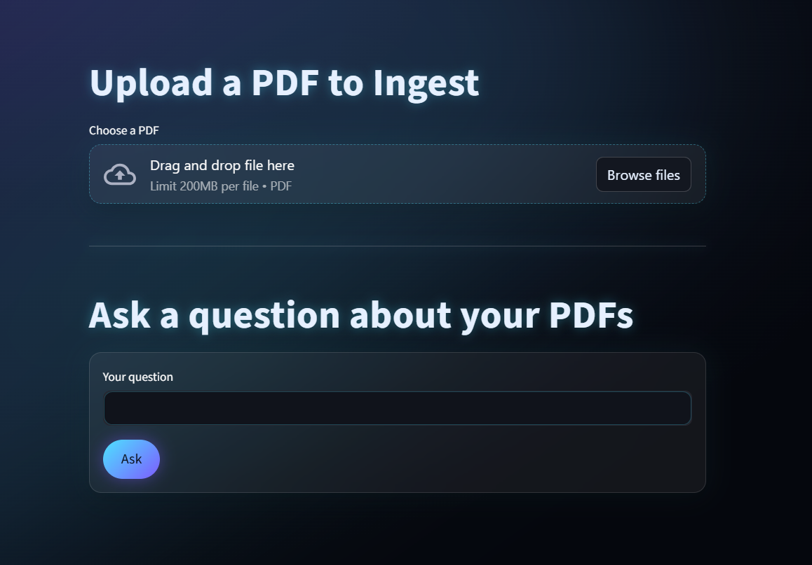
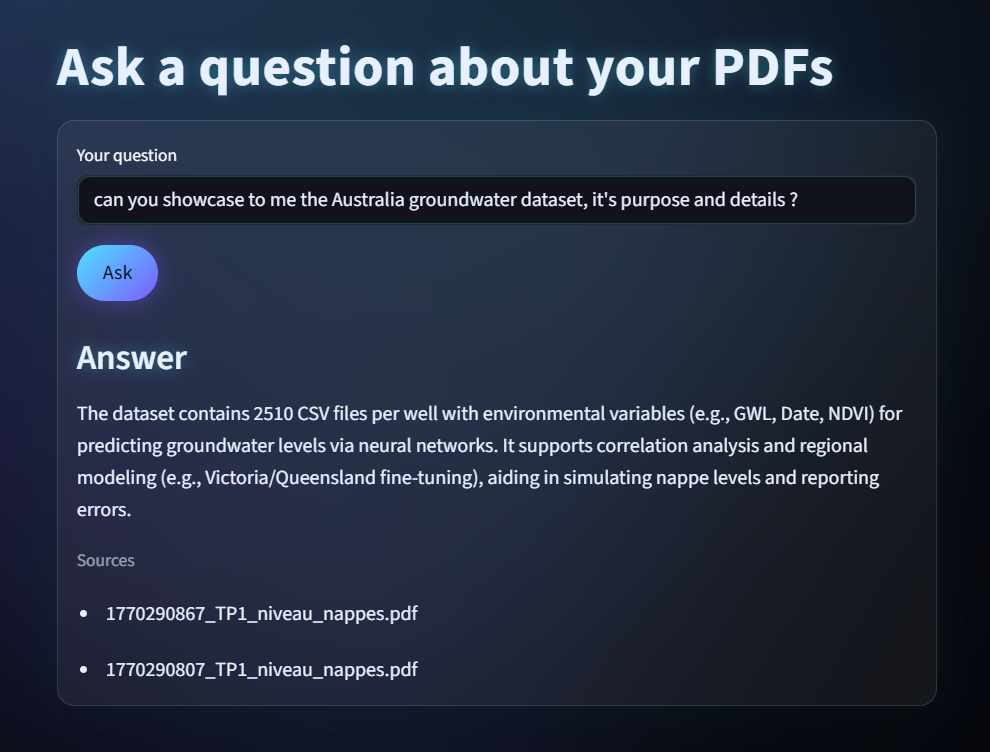

# 🤖 End-to-End RAG Chatbot 

[](https://github.com/Mustapha-Kdb/End-to-End-RAG-AI-chatbot/actions/workflows/build-and-push.yml)
[](https://www.python.org/)
[](https://fastapi.tiangolo.com/)
[](https://streamlit.io/)
[](https://aws.amazon.com/)
[](https://www.docker.com/)


**Live Demo:** 🚀 [https://ragbotmus.duckdns.org](https://ragbotmus.duckdns.org)

---

## 📋 Overview

**RAG Chatbot** is a production-ready Retrieval-Augmented Generation (RAG) application that enables intelligent document analysis through natural language queries. Upload your PDF documents and ask questions—the AI retrieves relevant content and generates accurate, sourced answers.

### ✨ Key Features

- 📄 **PDF Upload & Processing** - Automatically chunks and indexes documents
- 🔍 **Semantic Search** - Finds relevant content using vector embeddings
- 🤖 **AI-Powered Responses** - Generates answers grounded in your documents
- 🔐 **Production Security** - HTTPS, authentication, and secure storage
- 📊 **Real-time Monitoring** - CloudWatch logging and metrics
- 🚀 **Auto-Deployment** - GitHub Actions CI/CD with automatic updates
- 📈 **Scalable Architecture** - Docker, Kubernetes-ready deployment

---

## 🎨 Demo Screenshots

### Blank Interface


### With AI Response


---

## 🛠️ Technology Stack

### Frontend
| Technology | Purpose |
|-----------|---------|
|  | Web UI framework |
|  | Backend logic |

### Backend
| Technology | Purpose |
|-----------|---------|
|  | REST API framework |
|  | Workflow orchestration |
|  | Chunking and retrieval utilities |
|  | Document parsing and loaders |
|  | Vector database |

### DevOps & Infrastructure
| Technology | Purpose |
|-----------|---------|
|  | Containerization |
|  | Automated builds |
|  | Cloud hosting |
|  | PDF storage |
|  | Docker image registry |
|  | Logging & metrics |
|  | Reverse proxy |
|  | SSL/TLS certificates |

### APIs & Services
| Service | Purpose |
|---------|---------|
|  | Language model access |
|  | Domain management |

---

## 🚀 Quick Start

### Prerequisites
- Docker & Docker Compose
- AWS account with EC2, S3, ECR
- GitHub account for CI/CD
- OpenRouter API key
- `uv` installed

## 🔧 Configuration
Environment Variables
Create `.env` file:
```
# OpenRouter LLM
API_KEY=sk_YOUR_OPENROUTER_KEY

# Inngest
INNGEST_API_BASE=https://api.inngest.com/v1
INNGEST_SIGNING_KEY=your_signing_key
INNGEST_EVENT_KEY=your_event_key

# AWS
S3_BUCKET=your-bucket-name
AWS_REGION=eu-west-3

# Qdrant
QDRANT_URL=http://qdrant:6333
```

### Local Development

```bash
# Clone repository
git clone https://github.com/Mustapha-Kdb/End-to-End-RAG-AI-chatbot
cd RAG-chatbot

# Install dependencies
uv sync

# Create .env file
cp .env.example .env
# Edit .env with your credentials

# Start development server
docker compose up -d

# Access the app
# UI: http://localhost:8501
# API: http://localhost:8000
```
## 📚 How It Works

### 1. Document Upload
- User uploads PDF via Streamlit UI  
- File is stored in AWS S3 bucket  
- Inngest event triggers processing  

### 2. Indexing
- PDF is downloaded from S3  
- Text is chunked (recursive splitting)  
- Embeddings generated via OpenRouter  
- Vectors stored in Qdrant with metadata  

### 3. Query Processing
- User asks a question  
- Question is embedded  
- Qdrant searches for similar vectors (semantic search)  
- Top-K relevant chunks retrieved  

### 4. Answer Generation
- LLM (via OpenRouter) receives:
  - User's question  
  - Retrieved context chunks  
  - System prompt for grounding  
- Model generates answer based on context  
- Sources are extracted and returned  

---

## 🔄 CI/CD Pipeline
Every push to `main` branch triggers:

- **Build** — Docker images built for API & UI  
- **Push** — Images pushed to AWS ECR  
- **Deploy** — EC2 pulls and restarts containers  
- **Monitor** — Logs stream to CloudWatch  

See [.github/workflows/build-and-push.yml](.github/workflows/build-and-push.yml) for pipeline details.

---

## 📦 Project Structure
```
RAG-chatbot/
├── main.py                 # FastAPI + Inngest handlers
├── streamlit_app.py        # Streamlit UI
├── data_loader.py          # PDF processing & embeddings
├── vector_db.py            # Qdrant integration
├── custom_types.py         # Pydantic models
├── Dockerfile.api          # FastAPI container
├── Dockerfile.streamlit    # Streamlit container
├── docker-compose.yml      # Multi-container orchestration
├── pyproject.toml          # Python dependencies
├── .github/
│   └── workflows/
│       └── build-and-push.yml  # GitHub Actions CI/CD
└── screenshots/            # Demo images
```
---

## 📊 Performance & Scaling

### Current Capacity
- **Single EC2 (t3.small):** ~50–100 concurrent users  
- **Qdrant:** In-memory vector search, <100ms queries  
- **Response time:** 2–5 seconds (LLM dependent)  

### Scaling Options
1. **Load Balancer** — Distribute load across multiple EC2 instances  
2. **Auto Scaling** — Automatically add instances under high load  
3. **Qdrant Cloud** — Managed vector DB for larger deployments  
4. **CDN** — CloudFront for static assets (future) 

---

## ⚠️ Important Security Notice

### 🔒 Data Privacy
**Do NOT upload documents containing:**

- ❌ Personal identification numbers (SSN, passport, etc.)
- ❌ Credit card information
- ❌ Medical or health records
- ❌ Confidential business data
- ❌ Passwords or API keys

All uploaded PDF files are stored in an **AWS S3 bucket** and accessible through your AWS account. While encrypted in transit (HTTPS) and at rest (S3 encryption), treat this as a semi-public storage system.

**Use for:**
- ✅ Public documentation  
- ✅ Research papers  
- ✅ Manuals and guides  
- ✅ Non-sensitive training materials   